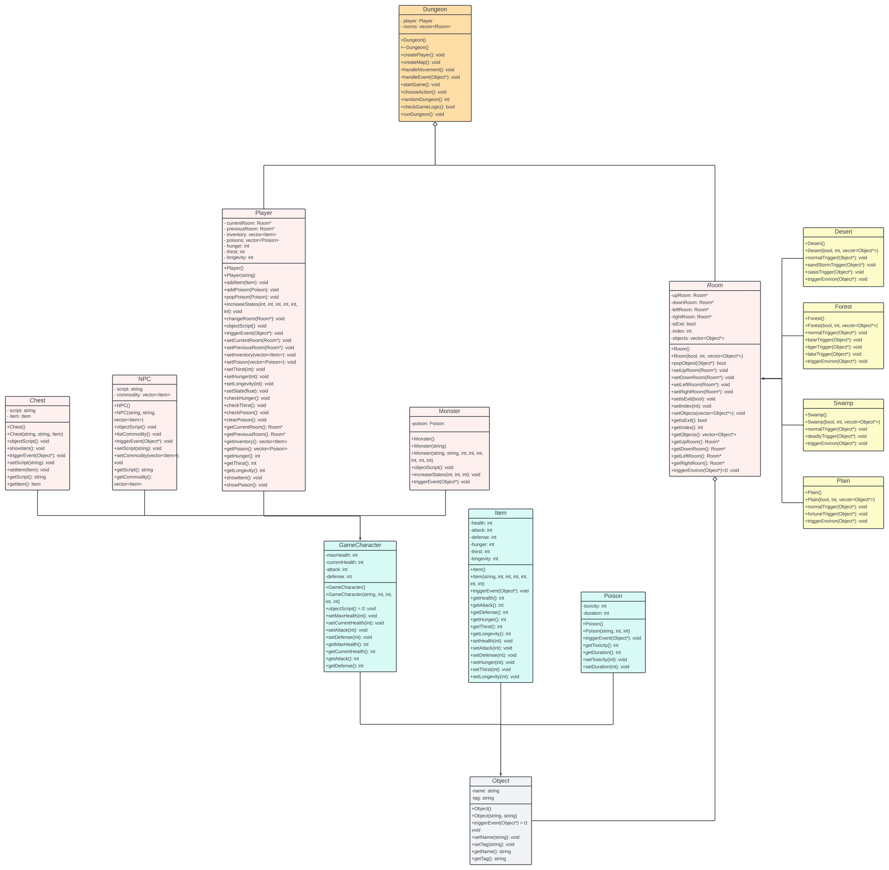

# Dungeon Game Documentation

## Demo

https://github.com/sodasmile1121/dungeon-project/assets/77041041/f5228f5e-4bba-4f44-9a45-1f1d2538ba13

## Description

This text-based dungeon game is a comprehensive project developed independently as part of the Data Structures and Object-Oriented Programming (DS&OOP) class at NYCU. It incorporates various features and mechanics to provide an engaging gameplay experience.

## Usage

To play the game, follow these steps:

1. Navigate to the dungeon directory.
2. Run `make` in the console to compile the game using the provided Makefile.
3. Enjoy exploring and playing the game!

## UML Structure

## Game Characters

### Player

- The player can move between rooms, check their current status, and interact with other characters within each room.

### NPC and Chest

- NPCs and chests may contain items that can positively or negatively impact the player's status when obtained.

### Monster

- Players can choose to engage monsters in combat. Winning against a monster clears poisons and boosts the player's stats, while losing adds additional poison.

## Room Design System

The game features four types of rooms, each with unique environments and random events:

- **Desert**: Sandstorms and oases.
- **Forest**: Encounters with bears, tigers, and lakes.
- **Swamp**: Deadly traps.
- **Plain**: Fortunes and mishaps.

## Status Systems

Players manage four primary status systems, each affected by different environments and events:

- **Hunger**
- **Thirst**
- **Poison**
- **Longevity**

## Dungeon Features

### Special Events

- Players may encounter special events in the dungeon, including:
  - A 5% chance to return to the starting room.
  - A 5% chance to reach the exit room, resulting in an immediate win.

## Game Logic

- **Loss Condition**: Player health drops to zero or below.
- **Win Conditions**:
  - Reaching the exit room with health greater than zero.
  - Accumulating a longevity value of 100 or more.

This project primarily focuses on designing intricate gameplay systems. Currently, there is one dungeon map available, with potential improvements planned for future updates.
